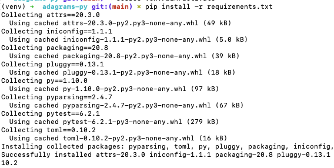

# Virtual Environments and Projects

<iframe src="https://adaacademy.hosted.panopto.com/Panopto/Pages/Embed.aspx?id=d9067779-45c7-404a-b4d4-acd9016b33a0&autoplay=false&offerviewer=true&showtitle=true&showbrand=false&start=0&interactivity=all" height="405" width="720" style="border: 1px solid #464646;" allowfullscreen allow="autoplay"></iframe>

## Ada Projects Will Use Virtual Environments

Ada projects will ask us to use virtual environments during project development.

This resource covers what we need to know in order for project time:

1. What are virtual environments?
1. Using virtual environments
   1. Making
   1. Activating
   1. Deactivating

## Introduction: Garages

Sometimes we need some space that's just a little different than what we currently have.

Monica loves throwing themed parties. She gets really excited and goes all in! She takes down her wall art in order to hang different lights. She moves her furniture to the side to make more space. She replaces her plates and utensils with themed ones!

Monica loves what she does, and isn't interested in decorating less! However, there is one annoying thing for Monica: her party decorations always changed her apartment layout. After each single party, she needs to set everything back for her daily life.

Monica daydreams about a magic invention. She wishes she could make a magical world. It would be her apartment, with everything set perfectly for the party, and everyone would have a great time. Once the party is over, she could step out of the magical world, back into her daily life, and her apartment would be back to normal... or rather, it would have never changed.

Monica wishes she had a virtual environment!

## Environments: Dev and Local

_Environments_ describe sets of installed and running software, languages, packages, and libraries. Environments can mean the entire setup of a computer system!

The phrase "dev environment" describes the setup of a computer system used to run software while devs are working on it. We can broadly say that our "local environment" is our own computer-- it's a setup used for us to develop and run software on, and it's local to us (hopefully in front of us!).

**Our local environment has Python installed on it.** The version of Python installed is whatever version is output when we run `$ python --version`.

## Virtual Environments

A virtual environment is an environment that is virtually created. In this case, "virtual" means that something exists, but not in actuality. A virtual environment is an entire computer system that installs and runs software, but it doesn't inhabit a dedicated physical machine... it was created and runs inside another environment.

If we wanted to suddenly write one project in specifically Python 3.8.4, but our current laptop has Python 3.8.5 installed, instead of reinstalling and uninstalling different versions of Python, we might be required to carry around a second laptop.

Instead of carrying around laptops, we could use virtual environments.

Because virtual environments are virtually created, they're easier to manage.

We'll make and activate virtual environments when we want specific packages installed, and deactivate them when they're no longer needed.

## Virtual Environments Help Us With Python3

Projects usually depend on a lot of packages being installed, so whenever we develop code for projects, we want to be cautious of our environment.

We'll change our development workflow, so that whenever we are working on a project, we'll activate a virtual environment. This environment will have every package and dependency set at the exact versions we want.

Most excitingly, these environments will have only Python3 installed.

### !callout-info

## Python3 is the Default `python` Version

When we create a virtual environment, we can specify to create it with Python3. When that's the case, whenever we're inside this activated environment, we can use `python3` _**and**_ `python` as commands to mean Python3.

### !end-callout

## Using `venv` In Projects

Projects should always direct us to use virtual environments during project development.

Here is a summary of the commands for working with a virtual environment:

```bash
### Make a virtual environment ###
$ cd project-root-folder # Virtual envs should be created in every project root
$ python3 -m venv venv

### Activate ###
$ source venv/bin/activate
(venv) $
(venv) $ # should see (venv) now

### Install Packages ###
pip install -r requirements.txt
# or #
pip install <package_name>

### Deactivate ###
(venv) $ deactivate
$
$ # should stop seeing (venv)
```

Read on for more details to understand what's going on.

### Create

At the beginning of a project, we need to create a virtual environment for this project once.

```bash
$ cd project-root-folder # Virtual envs should be created in every project root
$ python3 -m venv venv
```

| Piece of Syntax | Notes                                                                            |
| --------------- | -------------------------------------------------------------------------------- |
| `python3 -m`    | Use `python3` to look for a package and module to run                            |
| `venv`          | Use a package named `venv` whose purpose is to make virtual environments         |
| `venv`          | Every virtual environment needs a name, and the value `venv` will name it `venv` |

### !callout-info

#### `python3 -m venv venv`

Running this command creates a new folder that contains files for your virtual environment. With the above command, it creates a new folder named `venv`.

## A Virtual Environment Named `venv`?

The name for the virtual environment will help us identify it later. We could name our virtual environments anything, like `rainier` or `tacocat`. However, the name `venv` is a common, standard, normal name for one.

### !end-callout

### Activate at Beginning of Workflow

Before we run any Python commands in a project, before running tests, or installing dependencies, or any command that starts with `python3` or `python`... we need to _activate_ our virtual environment.

```bash
$ source venv/bin/activate
```

| Piece of Syntax     | Notes                                                                                                                                                                                                     |
| ------------------- | --------------------------------------------------------------------------------------------------------------------------------------------------------------------------------------------------------- |
| `source`            | A command that runs a given script, and loads the results into the current bash session (tab in Terminal). It says, "Please run this, and give me the benefits in this exact Terminal window now please!" |
| `venv/bin/activate` | This is the relative path to some script that activates our virtual environments named `venv`                                                                                                             |

#### Feedback

In an activated environment, the command line should change!

Typically, the name of the virtual environment will be at the beginning of each line.

```bash
(venv) $ project-root-folder
```

### Install Packages

To install packages from a file that contains a list of necessary packages/dependencies (e.g. `requirements.txt`) into the virtual environment, we run the command: 

```bash
pip install -r requirements.txt
```

To install a single package into the virtual environment, we run the command:

```bash
pip install <package_name>
```

#### Feedback

In the terminal, we should see text that indicates successful installation.



### !callout-info

#### `pip` not `pip3`

When performing a global install we use the command `pip3`. `pip3` will specify to use `pip` with Python 3. When using `pip` inside our virtual environment, we use the command `pip` because our virtual environment is an environment for managing packages with Python 3.

### !end-callout

### Deactivate at End of Workflow

To deactivate a virtual environment, we run the deactivate command:

```bash
$ deactivate
```

#### Feedback

After deactivation, the command line should no longer have the venv name.

```bash
$ project-root-folder
```

## Check For Understanding

<!-- Question 1 -->
<!-- prettier-ignore-start -->
### !challenge
* type: ordering
* id: JGjW8W
* title: Virtual Environments and Projects
##### !question

What is the general correct order of steps for creating, then activating, then installing the dependencies listed in a file, and finally deactivating a virtual environment?

##### !end-question
##### !answer

1. `cd project-root-folder`
1. `python3 -m venv venv`
1. `source venv/bin/activate`
1. `pip install -r requirements.txt`
1. `deactivate`

##### !end-answer
### !end-challenge
<!-- prettier-ignore-end -->
